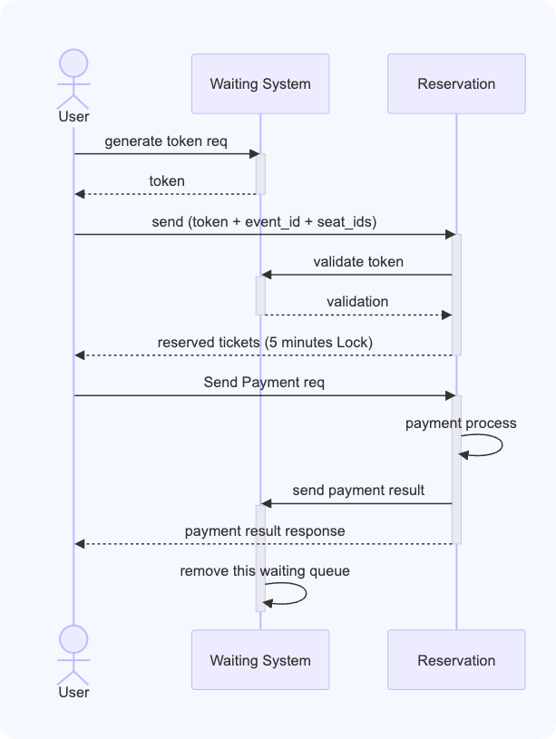
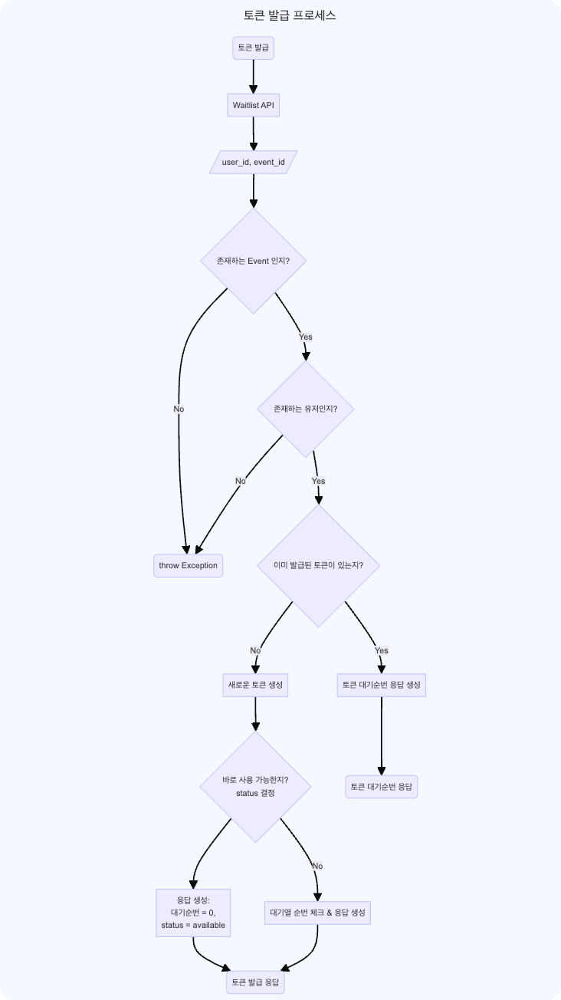

## Chapter2. 서버구축 (3-5주차)

### week3
#### Step5. 요구사항 설계 및 Milestone
-[x] 시나리오 선정 및 마일스톤 제출
  - 시나리오 선정 : 콘서트 예약서비스
  - [Milestone](https://github.com/kyun22/hhplus_w3to5/milestones) : github 마일스톤 기능 사용 
-[x] 요구사항 분석 자료 및 API 명세 제출
  - [API 명세 문서](https://documenter.getpostman.com/view/31502676/2sA35HWfuJ)
  - 티켓 구매 시퀀스 다이어그램 
    - 
  - 토큰 발급 플로우차트 
    - 

> 다이어그램은 mermaid 사용, 무료버전 5개 한계라서, /resources/diagrams/mermaid에 동명의 .txt파일로 저장

#### Step6. ERD, MockAPI
-[x] ERD 설계 자료 제출
  - 
-[x] Mock API 작성
-[x] Github repo 제출
