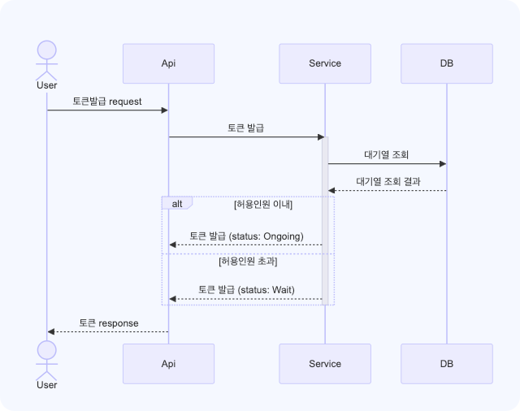

## Chapter2. 서버구축 (3-5주차)

### week5
#### 트러블슈팅 #1 Swagger 적용
Spring REST Docs + Swagger 로 구성 중 문제
1. org.springframework.restdocs 의존성이 import 되지 않음.
    - 
    - spring rest docs 작성을 위해서 필요한 의존성들이 들어오지 않음 
      - testImplementation("com.epages:restdocs-api-spec-mockmvc:0.19.2") 
    - 해결: 추가적인 의존성 설정 (build.gradle.kts)
      - testImplementation("org.springframework.restdocs:spring-restdocs-mockmvc")
      - 
2. 실행 후 바로 openapi3.yaml 내용으로 띄우기
    - 해결 : swagger-initializer.js 수정
    - 

#### 트러블슈팅 #2 Transactional 적용안됨
유저 포인트 충전 request (id:"user1", amount:1000)이 동시에 여러번 들어오는 경우 충전이 되지 않음
증상1) 유저가 조회되지 않음
- 원인 1: @Lock 을 JpaRepsoitory에 걸지 않음
  - Spring Data JPA기능으로 JpaRepository에 걸어야함

- 원인 2: 테스트에 @Transactional 이 걸려있어서
  - 해당하는 테스트 클래스나 테스트 메서드에 @Transactional이 걸려있으면 유저가 조회 안된다.
  - 이유는 아직모름.. Transactional 제거하고 ddl-auto를 create-drop으로 테스트

#### 트러블슈팅 #3 테이블 설계 변경
Event - Seat (1:N) 양방향 연관관계 제거
EventResponse에 Seat정보를 함께 응답으로 내려주기 위해서 Seat을 넣어놨었는데 다음의 이유로 연관관계를 제거하였다.
- 테스트 코드 작성이 어려움 : Event를 생성할때 Seat도 생성해서 넣어줘야 하고, 또 Seat에도 넣어줘야함.  
- Lock이 양쪽으로 걸릴 것 같아 제거
- Ticket 판매의 대상은 결국 Seat이기 때문에 Seat에서 정보를 갖는게 좋다고 생각.
- Concert, Event, Seat의 모든 정보 조회를 위해 다 조인해야해서, Seat에서는 concert, Event를 모두 갖도록 함.
- 이벤트의 리스트 응답에는 Seat 정보는 포함하지 않음. 1건 조회(id로 조회)에서만 Seat정보를 내려줌

#### 트러블슈팅 #4 통합테스트 작성에 대한 고민
UseCase만 테스트할건지? Repository도 테스트 하는지?
각 컴포넌트 별로? 아니면 액터의 유즈케이스를 그대로 따라가면서?

#### 트러블슈팅 #5 insert 두번
증상)
티켓 예약(결제 5분 대기) 이후 결제하는 통합테스트 작성중
1. 예약 -> Ticket 저장, Status: WAIT
2. 결제 -> 1항의 티켓 Status를 COMPLETE로 없데이트
할거라고 생각했는데 그렇지 않고 두번의 insert로 동작함.

#### 트러블슈팅 #6 EventPublisher 에서 StackOverFlowError
publishEvent 메서드가 무한정 실행되는 증상으로 StackOverFlow 발생
로깅을 위해서 ApplicationEventPublisher를 상속받아 커스텀 클래스를 만들었는데 자기 자신을 재귀적으로 호출해서 발생
해결은 해당클래스 삭제하고 그냥 ApplicationEventPublisher를 사용.

### week4
#### Swagger 적용 캡처사진

### week3
#### Step5. 요구사항 설계 및 Milestone
- 시나리오 선정 및 마일스톤 제출
  - 시나리오 선정 : 콘서트 예약서비스
  - [project](https://github.com/users/kyun22/projects/1)
  - [Milestone](https://github.com/kyun22/hhplus_w3to5/milestones) : github 마일스톤 기능 사용 
- 요구사항 분석 자료 및 API 명세 제출
  - [API 명세 문서](https://documenter.getpostman.com/view/31502676/2sA35HWfuJ)
 
##### 토큰 발급 시퀀스 다이어그램

##### 토큰 검증 시퀀스

##### 대기순번 조회 시퀀스 다이어그램

##### 포인트 충전 시퀀스 다이어그램

##### 포인트 조회 시퀀스 다이어그램

##### 콘서트 조회 시퀀스 다이어그램

##### 콘서트 티켓 예매 시퀀스 다이어그램

#### Step6. ERD, MockAPI
- ERD 설계 자료 제출
- Mock API 작성
- Github repo 제출

##### ERD
